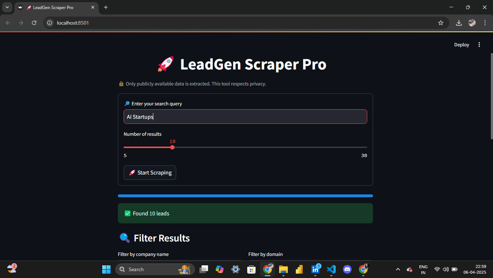
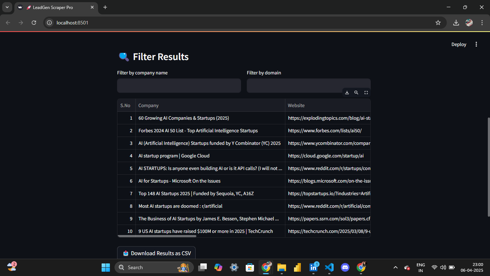

# 🚀 LeadGen Scraper Pro

LeadGen Scraper Pro is a lightweight Streamlit application that helps you extract **publicly available business leads** (emails, social media links, and domains) based on Google search queries. Perfect for marketers, sales teams, freelancers, or anyone looking to build lead lists fast and ethically.

> ⚠️ **Note:** This tool only scrapes publicly available data from the web and **respects privacy**. It does not access password-protected or private information.

---

## 🧰 Features

- 🔎 Google Custom Search API integration
- ✉️ Auto-detection of public emails
- 🌐 Extract LinkedIn, Twitter, and Facebook links
- 📊 Data filtering by company name or domain
- 📥 Export results to CSV
- 📈 Beautiful, styled UI powered by Streamlit

---

## 🚀 Demo




---

## 🔧 Requirements

- Python 3.7+
- Google Custom Search Engine (CSE) API Key
- Streamlit account (for deploying, optional)

---

## 📦 Installation

1. **Clone the repository**

```bash
git clone https://github.com/your-username/leadgen-scraper-pro.git
cd leadgen-scraper-pro
```

2. **Create a virtual environment (recommended)**

```bash
python -m venv venv
source venv/bin/activate  # On Windows: venv\Scripts\activate
```

3. **Install dependencies**

```bash
pip install -r requirements.txt
```

> Sample `requirements.txt`:
```
streamlit
pandas
requests
beautifulsoup4
```

---

## 🔐 API Setup

1. Go to [Google Cloud Console](https://console.cloud.google.com/)
2. Enable **Custom Search API**
3. Create an API key
4. Set up a **Custom Search Engine (CSE)** at [programmablesearchengine.google.com](https://programmablesearchengine.google.com/)
5. In the app, replace these variables with your credentials:

```python
API_KEY = "YOUR_GOOGLE_API_KEY"
SEARCH_ENGINE_ID = "YOUR_CSE_ID"
```

---

## ▶️ Running the App

```bash
streamlit run app.py
```

Open [http://localhost:8501](http://localhost:8501) in your browser.

---

## 🧠 Usage Tips

- Use **niche-specific queries** for better results:
  - `B2B SaaS startups in New York`
  - `email marketing tools in Berlin`
  - `AI consulting companies California contact email`

- Increase results up to **30** with the slider
- Filter by company name or domain after scraping

---

## 📤 Exporting

Click **📥 Download Results as CSV** to export your leads instantly.

---

## 🔒 Disclaimer

This tool only extracts publicly available data via Google search and respects robots.txt. Do not use this tool to spam or violate data protection laws like GDPR/CCPA.\
